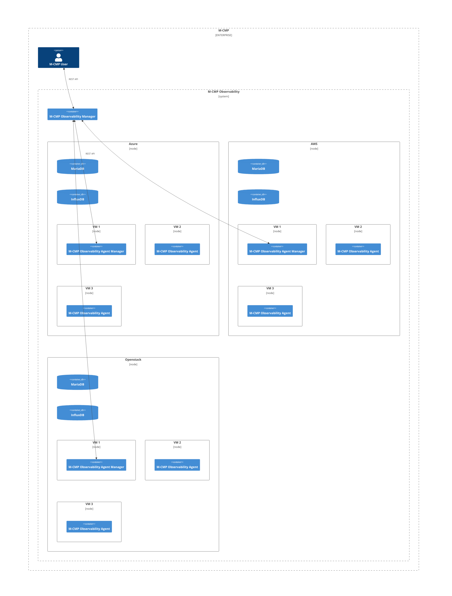
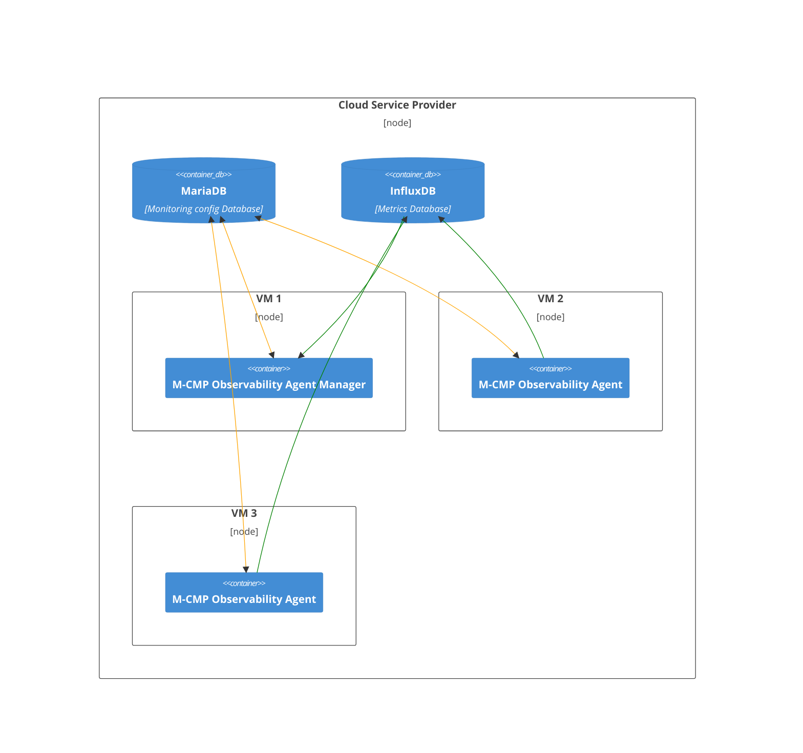
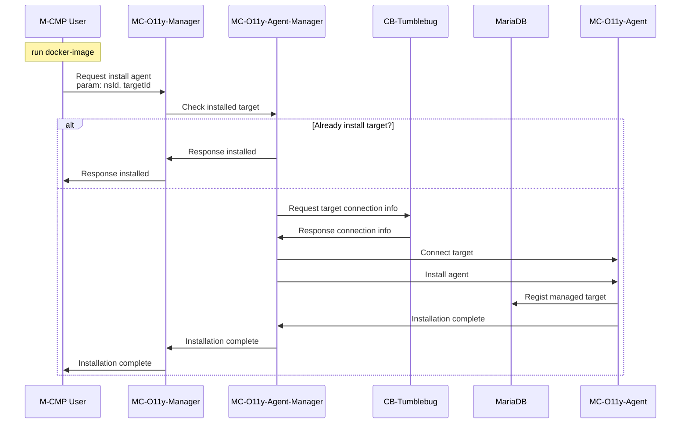

# mc-observability
[](https://app.fossa.com/projects/git%2Bgithub.com%2Fm-cmp%2Fmc-observability?ref=badge_shield)


This repository provides a Monitoring system of M-CMP.

A sub-system of [M-CMP platform](https://github.com/m-cmp/docs/tree/main) to deploy and manage Multi-Cloud Infrastructures. 

## Overview

- The package of this repository is a multi-cloud integrated monitoring framework that provides integrated monitoring capabilities for larger-scale infrastructure services and Kubernetes(K8S) services in a heterogeneous cloud integration environment.
- It offers insights based on operational management information.
- Through integrated monitoring and operational management of multi-clouds, it avoids the complexity between different clouds and centralizes management, enabling stable and efficient system operation.
- The overall flow of the integrated system is as follows: Information, Metrics, events, and log details of the monitoring target are collected through the cloud API and agents installed on vitual servers or physical equipment.\

## System architecture
<details>
<summary>접기/펼치기</summary>




</details>

## Development environment
- MariaDB (10.7.6)
- InfluxDB (1.8.10)
- Chronograf (1.10)
- Telegraf (1.29.5)
- SpringBoot (2.7.6)
- Java (17)
- cb-tumblebug (v0.9.18)
- cb-spider (edge + Azure Monitoring PoC patched)

## How to Use

### 1. Install Docker to Public VM
```shell
sudo apt-get install -y apt-transport-https ca-certificates curl gnupg-agent software-properties-common
curl -fsSL https://download.docker.com/linux/ubuntu/gpg | sudo apt-key add -
sudo add-apt-repository "deb [arch=amd64] https://download.docker.com/linux/ubuntu $(lsb_release -cs) stable"
sudo apt-get update
sudo apt-get install -y docker-ce docker-ce-cli docker-compose-plugin
```

### 2. Clone observability source to Public VM
```
git clone https://github.com/m-cmp/mc-observability.git
```

### 3. Go to Java folder
```
cd mc-observability/java-module
```

### 4. set .env (edit .env) (Or skip this step for use defaults.)
```
cp .env.sample .env
```

### 5. Run docker services
```
sudo mkdir -p /docker/opensearch
sudo mkdir -p /docker/kapacitor_data
sudo chown -R 1000:1000 /docker/opensearch
sudo chown -R 999:999 /docker/kapacitor_data
sudo docker compose up -d
```

### 6. Check network listen states
```
sudo ss -nltp | grep docker                                                                                                       12:03:20 PM
LISTEN 0      4096              0.0.0.0:1024       0.0.0.0:*    users:(("docker-proxy",pid=21828,fd=4))
LISTEN 0      4096              0.0.0.0:1324       0.0.0.0:*    users:(("docker-proxy",pid=18004,fd=4))
LISTEN 0      4096              0.0.0.0:1325       0.0.0.0:*    users:(("docker-proxy",pid=17943,fd=4))
LISTEN 0      4096              0.0.0.0:1323       0.0.0.0:*    users:(("docker-proxy",pid=18311,fd=4))
LISTEN 0      4096              0.0.0.0:3306       0.0.0.0:*    users:(("docker-proxy",pid=21737,fd=4))
LISTEN 0      4096              0.0.0.0:5601       0.0.0.0:*    users:(("docker-proxy",pid=22105,fd=4))
LISTEN 0      4096              0.0.0.0:8086       0.0.0.0:*    users:(("docker-proxy",pid=21771,fd=4))
LISTEN 0      4096              0.0.0.0:8082       0.0.0.0:*    users:(("docker-proxy",pid=21805,fd=4))
LISTEN 0      4096              0.0.0.0:8888       0.0.0.0:*    users:(("docker-proxy",pid=21951,fd=4))
LISTEN 0      4096              0.0.0.0:9200       0.0.0.0:*    users:(("docker-proxy",pid=22183,fd=4))
LISTEN 0      4096              0.0.0.0:9600       0.0.0.0:*    users:(("docker-proxy",pid=22160,fd=4))
LISTEN 0      4096              0.0.0.0:18080      0.0.0.0:*    users:(("docker-proxy",pid=21915,fd=4))
LISTEN 0      4096              0.0.0.0:18081      0.0.0.0:*    users:(("docker-proxy",pid=21863,fd=4))
LISTEN 0      4096                 [::]:1024          [::]:*    users:(("docker-proxy",pid=21834,fd=4))
LISTEN 0      4096                 [::]:1324          [::]:*    users:(("docker-proxy",pid=18012,fd=4))
LISTEN 0      4096                 [::]:1325          [::]:*    users:(("docker-proxy",pid=17950,fd=4))
LISTEN 0      4096                 [::]:1323          [::]:*    users:(("docker-proxy",pid=18322,fd=4))
LISTEN 0      4096                 [::]:3306          [::]:*    users:(("docker-proxy",pid=21745,fd=4))
LISTEN 0      4096                 [::]:5601          [::]:*    users:(("docker-proxy",pid=22111,fd=4))
LISTEN 0      4096                 [::]:8086          [::]:*    users:(("docker-proxy",pid=21778,fd=4))
LISTEN 0      4096                 [::]:8082          [::]:*    users:(("docker-proxy",pid=21812,fd=4))
LISTEN 0      4096                 [::]:8888          [::]:*    users:(("docker-proxy",pid=21959,fd=4))
LISTEN 0      4096                 [::]:9200          [::]:*    users:(("docker-proxy",pid=22189,fd=4))
LISTEN 0      4096                 [::]:9600          [::]:*    users:(("docker-proxy",pid=22167,fd=4))
LISTEN 0      4096                 [::]:18080         [::]:*    users:(("docker-proxy",pid=21922,fd=4))
LISTEN 0      4096                 [::]:18081         [::]:*    users:(("docker-proxy",pid=21873,fd=4))
```

### 7. Clone tumblebug source (Run on the same Public VM)
```
git clone https://github.com/m-cmp/mc-observability.git
cd cb-tumblebug
```

### 8. Initialize tumblebug (Run on the same Public  VM)
[Initialize CB-Tumblebug to configure Multi-Cloud info](https://github.com/cloud-barista/cb-tumblebug?tab=readme-ov-file#3-initialize-cb-tumblebug-to-configure-multi-cloud-info)

### 9. Create namespace to tumblebug (Run on the same Public VM)
```shell
curl -u default:default -X 'POST' \
  'http://127.0.0.1:1323/tumblebug/ns' \
  -H 'accept: application/json' \
  -H 'Content-Type: application/json' \
  -d '{
  "description": "First namespace",
  "name": "ns01"
}'
```

### 10. Create MCI dynamically (Run on the same Public VM)
```shell
curl -u default:default -X 'POST' \
  'http://127.0.0.1:1323/tumblebug/ns/ns01/mciDynamic' \
  -H 'accept: application/json' \
  -H 'Content-Type: application/json' \
  -d '{
  "description": "Made in CB-TB",
  "installMonAgent": "no",
  "name": "mci01",
  "systemLabel": "",
  "vm": [
    {
      "commonImage": "azure+koreacentral+ubuntu22.04",
      "commonSpec": "azure+koreacentral+standard_b4ls_v2",
      "connectionName": "azure-koreacentral",
      "description": "Description",
      "name": "g1-1",
      "rootDiskSize": "default",
      "rootDiskType": "default",
      "subGroupSize": "2"
    }
  ]
}'
```

### 11. Register monitoring targets to observability manager (Run on any host)
```shell
curl --location 'http://observability_VM_PUBLIC_IP:18080/api/o11y/monitoring/ns01/mci01/target/g1-1-1' \
--header 'Content-Type: application/json' \
--header 'Accept: */*' \
--data '{
  "description": "vm1",
  "aliasName": "g1"
}'
```
```shell
curl --location 'http://observability_VM_PUBLIC_IP:18080/api/o11y/monitoring/ns01/mci01/target/g1-1-2' \
--header 'Content-Type: application/json' \
--header 'Accept: */*' \
--data '{
  "description": "vm2",
  "aliasName": "g2"
}'
```

### 12. Check registered monitoring targets from observability (Run on any host)
```shell
curl --location 'http://observability_VM_PUBLIC_IP:18080/api/o11y/monitoring/ns01/mci01/target' \
--header 'Accept: */*' | jq
```


### 13. Check VM's syslog (Run on any host)
g1-1-1 example)

```shell
curl --location 'http://observability_VM_PUBLIC_IP:18080/api/o11y/monitoring/opensearch/logs' \
--header 'Content-Type: application/json' \
--header 'Accept: */*' \
--data '{
    "conditions": [
        {
            "key": "tail.message",
            "value": "mc-o11y-agent"
        },
        {
            "key": "ns_id",
            "value": "ns01"
        },
        {
            "key": "mci_id",
            "value": "mci01"
        },
        {
            "key": "target_id",
            "value": "g1-1-1"
        }
    ],
    "range": "7d",
    "limit": 3
} | jq
```

- Response example
    <details>
    <summary>접기/펼치기</summary>
    
    ```json
    {
        "data": [
            {
                "@timestamp": "2024-10-21T10:10:04.232093678Z",
                "measurement_name": "tail",
                "tag": {
                    "host": "7ba96fb72305",
                    "mci_id": "mci01",
                    "ns_id": "ns01",
                    "path": "/var/log/syslog",
                    "target_id": "g1-1-1"
                },
                "tail": {
                    "host": "cs8s1jv02jcs73dqejhg",
                    "message": "cs8s1jv02jcs73dqejhg mc-o11y-agent[678]: 2024-10-21 10:10:04.231 ERROR 7 --- [   scheduling-1] m.m.o.m.m.service.MonitoringService      : NullPointerException: Cannot invoke \"java.util.List.iterator()\" because the return value of \"mcmp.mc.observability.mco11yagent.monitoring.model.SpiderMonitoringInfo$Data.getTimestampValues()\" is null",
                    "timestamp": "Oct 21 10:10:04"
                }
            },
            {
                "@timestamp": "2024-10-21T10:09:03.806398856Z",
                "measurement_name": "tail",
                "tag": {
                    "host": "7ba96fb72305",
                    "mci_id": "mci01",
                    "ns_id": "ns01",
                    "path": "/var/log/syslog",
                    "target_id": "g1-1-1"
                },
                "tail": {
                    "host": "cs8s1jv02jcs73dqejhg",
                    "message": "cs8s1jv02jcs73dqejhg mc-o11y-agent[678]: 2024-10-21 10:09:03.805 ERROR 7 --- [   scheduling-1] m.m.o.m.m.service.MonitoringService      : NullPointerException: Cannot invoke \"java.util.List.iterator()\" because the return value of \"mcmp.mc.observability.mco11yagent.monitoring.model.SpiderMonitoringInfo$Data.getTimestampValues()\" is null",
                    "timestamp": "Oct 21 10:09:03"
                }
            },
            {
                "@timestamp": "2024-10-21T10:08:03.972426034Z",
                "measurement_name": "tail",
                "tag": {
                    "host": "7ba96fb72305",
                    "mci_id": "mci01",
                    "ns_id": "ns01",
                    "path": "/var/log/syslog",
                    "target_id": "g1-1-1"
                },
                "tail": {
                    "host": "cs8s1jv02jcs73dqejhg",
                    "message": "cs8s1jv02jcs73dqejhg mc-o11y-agent[678]: 2024-10-21 10:08:03.971 ERROR 7 --- [   scheduling-1] m.m.o.m.m.service.MonitoringService      : NullPointerException: Cannot invoke \"java.util.List.iterator()\" because the return value of \"mcmp.mc.observability.mco11yagent.monitoring.model.SpiderMonitoringInfo$Data.getTimestampValues()\" is null",
                    "timestamp": "Oct 21 10:08:03"
                }
            }
        ],
        "error_message": "",
        "rs_code": "0000",
        "rs_msg": "완료되었습니다."
    }
    ```
    </details>

### 14. Check VM's monitoring data from o11y storage
#### 14.1 Get collected measurement & field list
```shell
curl --location 'http://observability_VM_PUBLIC_IP:18080/api/o11y/monitoring/ns01/mci01/target/g1-1-1/csp/cpu_usage' \
--header 'Accept: */*' | jq
```

- Response example
    <details>
    <summary>접기/펼치기</summary>

    ```json
    {
      "data": [
        {
          "measurement": "cpu",
          "fields": [
            {
              "field_key": "usage_guest",
              "field_type": "float"
            },
            {
              "field_key": "usage_guest_nice",
              "field_type": "float"
            },
            {
              "field_key": "usage_idle",
              "field_type": "float"
            },
            {
              "field_key": "usage_iowait",
              "field_type": "float"
            },
            {
              "field_key": "usage_irq",
              "field_type": "float"
            },
            {
              "field_key": "usage_nice",
              "field_type": "float"
            },
            {
              "field_key": "usage_softirq",
              "field_type": "float"
            },
            {
              "field_key": "usage_steal",
              "field_type": "float"
            },
            {
              "field_key": "usage_system",
              "field_type": "float"
            },
            {
              "field_key": "usage_user",
              "field_type": "float"
            }
          ]
        },
        {
          "measurement": "disk",
          "fields": ...
        },
        {
          "measurement": "diskio",
          "fields": ...
        },
        {
          "measurement": "mem",
          "fields": ...
        },
        {
          "measurement": "processes",
          "fields": ...
        },
        {
          "measurement": "swap",
          "fields": ...
        },
        {
          "measurement": "system",
          "fields": ...
        },
        {
          "measurement": "tail",
          "fields": ...
        }
      ],
      "error_message": "",
      "rs_code": "0000",
      "rs_msg": "완료되었습니다."
    }
    ```
    </details>


#### 14.2 Get VM's monitoring data (g1-1-1 example)

```shell
curl --location 'http://observability_VM_PUBLIC_IP:18080/api/o11y/monitoring/influxdb/metric' \
--header 'Content-Type: application/json' \
--header 'Accept: */*' \
--data '{
  "measurement": "cpu",
  "range": "1h",
  "group_time": "1m",
  "group_by": [
    "uuid",
    "cpu"
  ],
  "limit": 10,
  "fields": [
    {
      "function": "mean",
      "field": "usage_idle"
    }
  ],
  "conditions": [
    {
      "key": "cpu",
      "value": "cpu-total"
    },
    {
      "key": "target_id",
      "value": "g1-1-1"
    }
  ]
}' | jq
```

- Response example
    <details>
    <summary>접기/펼치기</summary>

    ```json
    {
      "data": [
        {
          "name": "cpu",
          "columns": [
            "timestamp",
            "usage_idle"
          ],
          "tags": {
            "cpu": "cpu-total",
            "uuid": ""
          },
          "values": [
            [
              "2024-10-21T10:46:00Z",
              99.76217768454649
            ],
            [
              "2024-10-21T10:45:00Z",
              99.76207420680639
            ],
            [
              "2024-10-21T10:44:00Z",
              99.76556577083716
            ],
            [
              "2024-10-21T10:43:00Z",
              99.73291702300929
            ],
            [
              "2024-10-21T10:42:00Z",
              99.73715154596097
            ],
            [
              "2024-10-21T10:41:00Z",
              99.71906643784685
            ],
            [
              "2024-10-21T10:40:00Z",
              99.77460653983535
            ],
            [
              "2024-10-21T10:39:00Z",
              99.73011568466434
            ],
            [
              "2024-10-21T10:38:00Z",
              99.68277242593535
            ],
            [
              "2024-10-21T10:37:00Z",
              99.65347458194857
            ]
          ]
        }
      ],
      "error_message": "",
      "rs_code": "0000",
      "rs_msg": "완료되었습니다."
    }
    ```
    </details>

### 15. Check VM's monitoring data from CSP (Get from cb-spider Azure Monitoring PoC)

The API below only works with VMs deployed on Azure.

- Supported metric types
  - cpu_usage (%)
  - memory_usage (Bytes)
  - disk_read (Bytes)
  - disk_write (Bytes)
  - disk_read_ops (Bytes)
  - disk_write_ops (Bytes)
  - network_in (Bytes)
  - network_out (Bytes)
- Range and interval of metrics
  - Retrieves 1-minute interval metric data from 1 hour ago
- Time is displayed in UTC.

g1-1-1 cpu_usage example)

```shell
curl --location 'http://observability_VM_PUBLIC_IP:18080/api/o11y/monitoring/ns01/mci01/target/g1-1-1/csp/cpu_usage' \
--header 'Accept: */*' | jq
```

- Response example
    <details>
    <summary>접기/펼치기</summary>

    ```json
    {
      "data": {
        "metricName": "Percentage CPU",
        "metricUnit": "Percent",
        "timestampValues": [
          {
            "timestamp": "2024-09-20T01:54:00Z",
            "value": "0.345"
          },
          {
            "timestamp": "2024-09-20T01:55:00Z",
            "value": "0.355"
          },
          {
            "timestamp": "2024-09-20T01:56:00Z",
            "value": "0.355"
          },
          {
            "timestamp": "2024-09-20T01:57:00Z",
            "value": "0.365"
          },
          {
            "timestamp": "2024-09-20T01:58:00Z",
            "value": "0.365"
          },
          {
            "timestamp": "2024-09-20T01:59:00Z",
            "value": "0.375"
          },
          {
            "timestamp": "2024-09-20T02:00:00Z",
            "value": "0.36"
          },
          {
            "timestamp": "2024-09-20T02:01:00Z",
            "value": "0.445"
          },
          {
            "timestamp": "2024-09-20T02:02:00Z",
            "value": "0.4"
          },
          {
            "timestamp": "2024-09-20T02:03:00Z",
            "value": "0.345"
          },
          {
            "timestamp": "2024-09-20T02:04:00Z",
            "value": "0.345"
          },
          {
            "timestamp": "2024-09-20T02:05:00Z",
            "value": "0.33"
          },
          {
            "timestamp": "2024-09-20T02:06:00Z",
            "value": "0.35"
          },
          {
            "timestamp": "2024-09-20T02:07:00Z",
            "value": "0.375"
          },
          {
            "timestamp": "2024-09-20T02:08:00Z",
            "value": "0.39"
          },
          {
            "timestamp": "2024-09-20T02:09:00Z",
            "value": "0.345"
          },
          {
            "timestamp": "2024-09-20T02:10:00Z",
            "value": "0.405"
          },
          {
            "timestamp": "2024-09-20T02:11:00Z",
            "value": "0.345"
          },
          {
            "timestamp": "2024-09-20T02:12:00Z",
            "value": "0.335"
          },
          {
            "timestamp": "2024-09-20T02:13:00Z",
            "value": "0.33"
          },
          {
            "timestamp": "2024-09-20T02:14:00Z",
            "value": "0.33"
          },
          {
            "timestamp": "2024-09-20T02:15:00Z",
            "value": "0.31"
          },
          {
            "timestamp": "2024-09-20T02:16:00Z",
            "value": "0.31"
          },
          {
            "timestamp": "2024-09-20T02:17:00Z",
            "value": "0.31"
          },
          {
            "timestamp": "2024-09-20T02:18:00Z",
            "value": "0.28"
          },
          {
            "timestamp": "2024-09-20T02:19:00Z",
            "value": "0.28"
          },
          {
            "timestamp": "2024-09-20T02:20:00Z",
            "value": "0.29"
          },
          {
            "timestamp": "2024-09-20T02:21:00Z",
            "value": "0.285"
          },
          {
            "timestamp": "2024-09-20T02:22:00Z",
            "value": "0.275"
          },
          {
            "timestamp": "2024-09-20T02:23:00Z",
            "value": "0.305"
          },
          {
            "timestamp": "2024-09-20T02:24:00Z",
            "value": "0.27"
          },
          {
            "timestamp": "2024-09-20T02:25:00Z",
            "value": "0.275"
          },
          {
            "timestamp": "2024-09-20T02:26:00Z",
            "value": "0.27"
          },
          {
            "timestamp": "2024-09-20T02:27:00Z",
            "value": "0.265"
          },
          {
            "timestamp": "2024-09-20T02:28:00Z",
            "value": "0.27"
          },
          {
            "timestamp": "2024-09-20T02:29:00Z",
            "value": "0.275"
          },
          {
            "timestamp": "2024-09-20T02:30:00Z",
            "value": "0.305"
          },
          {
            "timestamp": "2024-09-20T02:31:00Z",
            "value": "0.315"
          },
          {
            "timestamp": "2024-09-20T02:32:00Z",
            "value": "0.265"
          },
          {
            "timestamp": "2024-09-20T02:33:00Z",
            "value": "0.28"
          },
          {
            "timestamp": "2024-09-20T02:34:00Z",
            "value": "0.265"
          },
          {
            "timestamp": "2024-09-20T02:35:00Z",
            "value": "0.26"
          },
          {
            "timestamp": "2024-09-20T02:36:00Z",
            "value": "0.26"
          },
          {
            "timestamp": "2024-09-20T02:37:00Z",
            "value": "0.51"
          },
          {
            "timestamp": "2024-09-20T02:38:00Z",
            "value": "13.18"
          },
          {
            "timestamp": "2024-09-20T02:39:00Z",
            "value": "13.165"
          },
          {
            "timestamp": "2024-09-20T02:40:00Z",
            "value": "0.98"
          },
          {
            "timestamp": "2024-09-20T02:41:00Z",
            "value": "0.685"
          },
          {
            "timestamp": "2024-09-20T02:42:00Z",
            "value": "0.455"
          },
          {
            "timestamp": "2024-09-20T02:43:00Z",
            "value": "0.445"
          },
          {
            "timestamp": "2024-09-20T02:44:00Z",
            "value": "0.37"
          },
          {
            "timestamp": "2024-09-20T02:45:00Z",
            "value": "0.475"
          },
          {
            "timestamp": "2024-09-20T02:46:00Z",
            "value": "0.44"
          },
          {
            "timestamp": "2024-09-20T02:47:00Z",
            "value": "0.34"
          },
          {
            "timestamp": "2024-09-20T02:48:00Z",
            "value": "0.31"
          },
          {
            "timestamp": "2024-09-20T02:49:00Z",
            "value": "0.32"
          },
          {
            "timestamp": "2024-09-20T02:50:00Z",
            "value": "0.375"
          },
          {
            "timestamp": "2024-09-20T02:51:00Z",
            "value": "0.34"
          },
          {
            "timestamp": "2024-09-20T02:52:00Z",
            "value": "0.245"
          },
          {
            "timestamp": "2024-09-20T02:53:00Z",
            "value": "0.365"
          }
        ]
      },
      "errorMessage": null,
      "rsCode": "0000",
      "rsMsg": "완료되었습니다."
    }
    ```
    </details>

### Swagger Docs
#### [v0.3.0 swagger api](https://m-cmp.github.io/mc-observability/java-module/swagger/index.html)

### API Use guide (swagger docs linked mermaid contents)
#### Observability Monitoring target setting guide



## How to Contribute

- Issues/Discussions/Ideas: Utilize issue of mc-observability


## License
[](https://app.fossa.com/projects/git%2Bgithub.com%2Fm-cmp%2Fmc-observability?ref=badge_large)