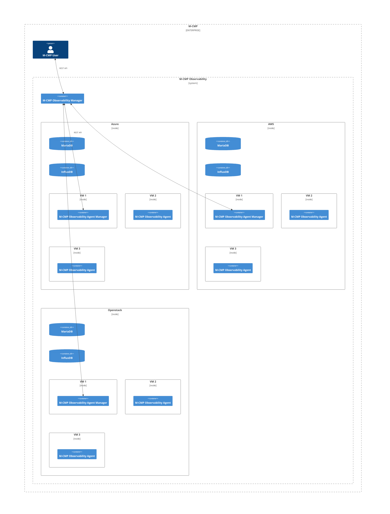
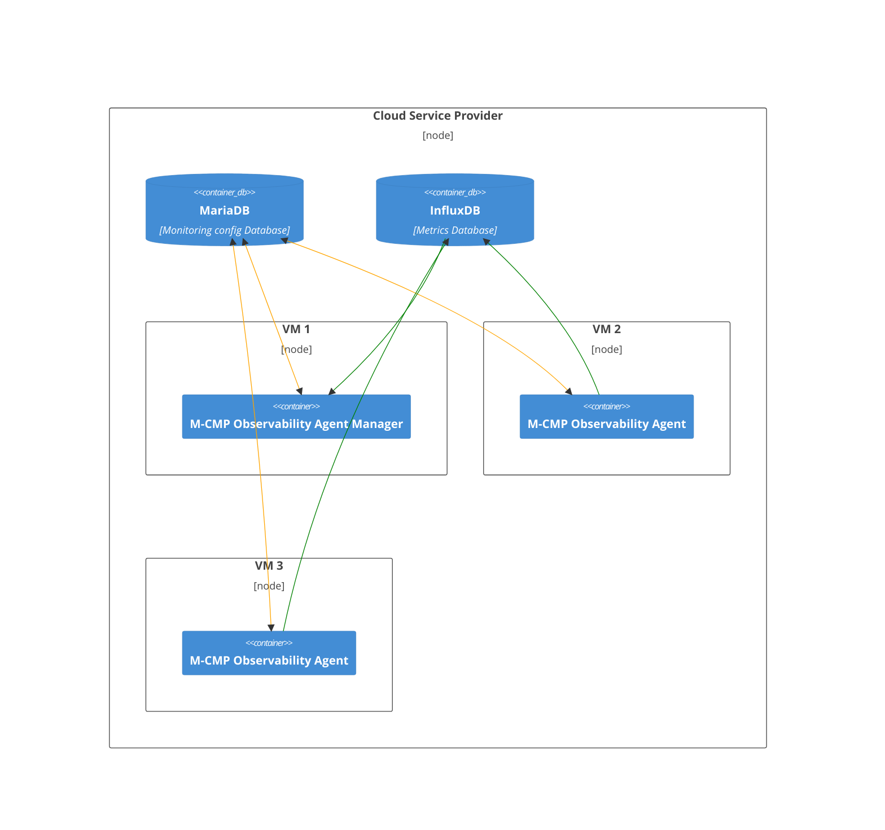
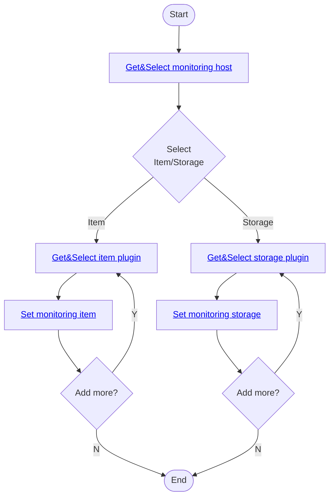
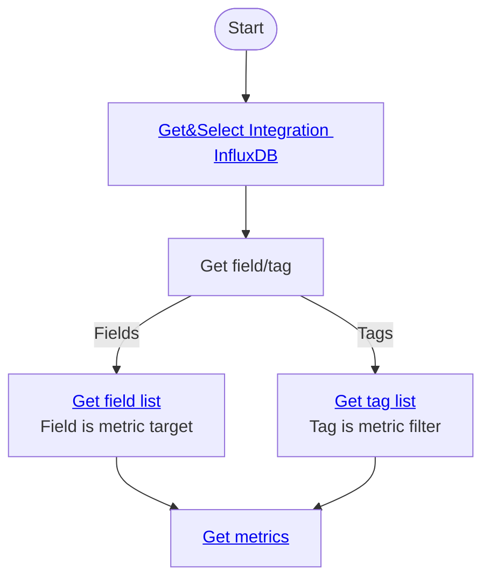
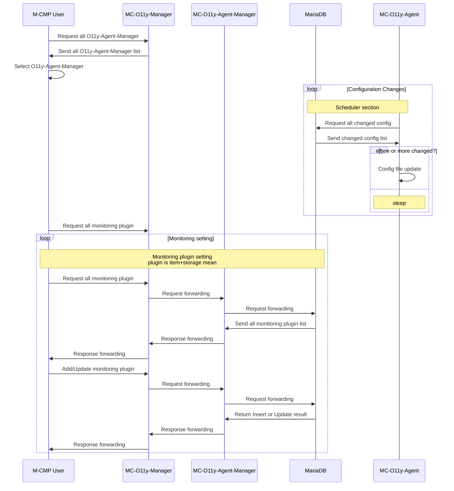

# mc-observability
[](https://app.fossa.com/projects/git%2Bgithub.com%2Fm-cmp%2Fmc-observability?ref=badge_shield)


This repository provides a Monitoring system of M-CMP.

A sub-system of [M-CMP platform](https://github.com/m-cmp/docs/tree/main) to deploy and manage Multi-Cloud Infrastructures. 

## Overview

- The package of this repository is a multi-cloud integrated monitoring framework that provides integrated monitoring capabilities for larger-scale infrastructure services and Kubernetes(K8S) services in a heterogeneous cloud integration environment.
- It offers insights based on operational management information.
- Through integrated monitoring and operational management of multi-clouds, it avoids the complexity between different clouds and centralizes management, enabling stable and efficient system operation.
- The overall flow of the integrated system is as follows: Information, Metrics, events, and log details of the monitoring target are collected through the cloud API and agents installed on vitual servers or physical equipment.\

### System architecture
<details>
<summary>접기/펼치기</summary>




</details>

## How to Use

### Development environment
  - MariaDB (10.7.6)
  - InfluxDB (1.8.10)
  - Chronograf (1.10)
  - Telegraf (1.26.1)
  - SpringBoot (2.7.6)
  - Java (17)

### Step one: clone source
```
$ git clone https://github.com/m-cmp/mc-observability.git ${YourFolderName}
```

### Step two: Go to Java folder
```
$ cd ${YourFolderName}/java
```

### Step three: Subsystem docker-compose run
```
$ docker-compose up -d
```

### Step four: Network check
```
$ netstat -lntp
# Active Internet connections (only servers)
# Proto Recv-Q Send-Q Local Address           Foreign Address         State       PID/Program name
# tcp        0      0 0.0.0.0:8888            0.0.0.0:*               LISTEN      ${YourPID}/docker-proxy
# tcp        0      0 0.0.0.0:3306            0.0.0.0:*               LISTEN      ${YourPID}/docker-proxy
# tcp        0      0 0.0.0.0:8086            0.0.0.0:*               LISTEN      ${YourPID}/docker-proxy
# tcp6       0      0 :::8888                 :::*                    LISTEN      ${YourPID}/docker-proxy
# tcp6       0      0 :::3306                 :::*                    LISTEN      ${YourPID}/docker-proxy
# tcp6       0      0 :::8086                 :::*                    LISTEN      ${YourPID}/docker-proxy
```

### Step five: Run install script
```
$ script/install.sh
```

### Swagger Docs
https://m-cmp.github.io/mc-observability/java/swagger

#### [v0.3.0 swagger api preview](https://m-cmp.github.io/mc-observability/java/swagger/index_copy.html)

### API Use guide (swagger docs linked mermaid contents)
#### Observability Monitoring target setting guide

<details>
<summary>접기/펼치기</summary>



#### Observability Metrics view guide



#### M-CMP Observability monitoring setting sequenceDiagram


</details>

## How to Contribute

- Issues/Discussions/Ideas: Utilize issue of mc-observability


## License
[](https://app.fossa.com/projects/git%2Bgithub.com%2Fm-cmp%2Fmc-observability?ref=badge_large)