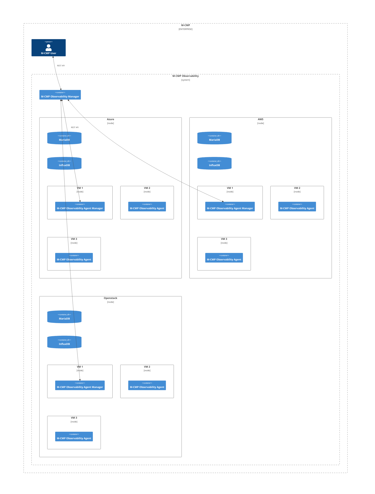
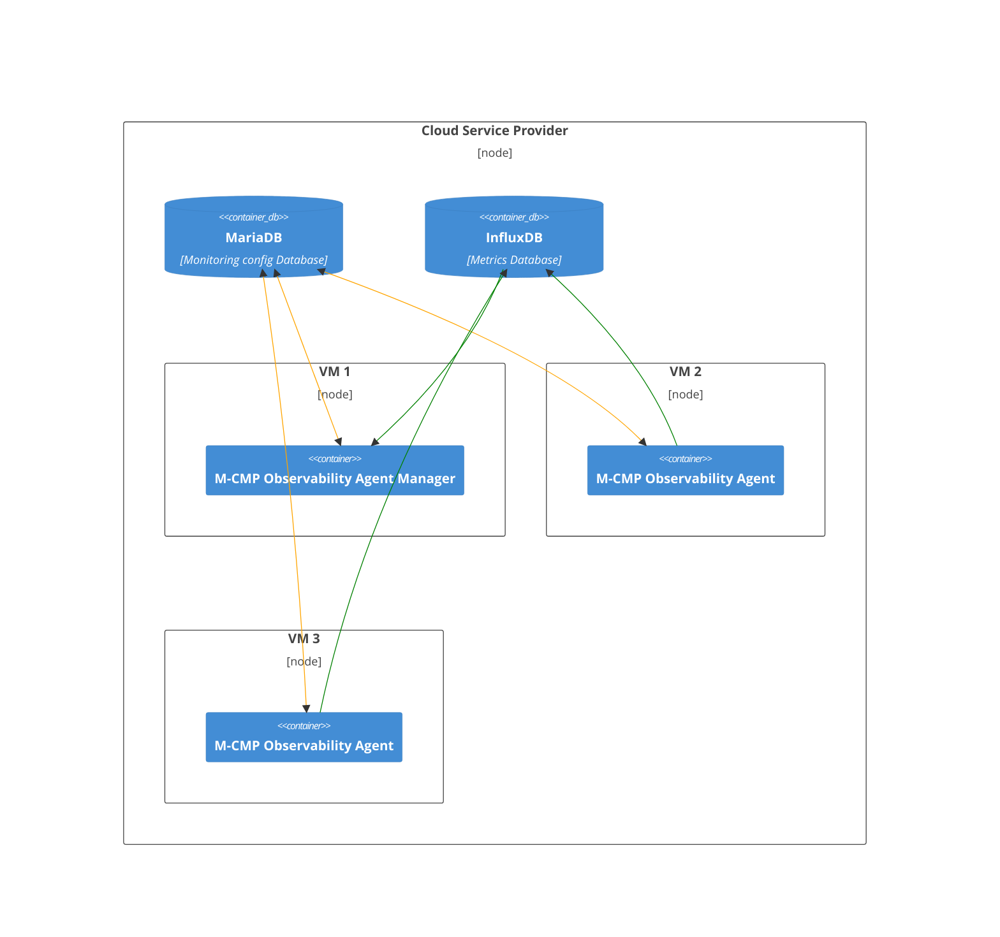
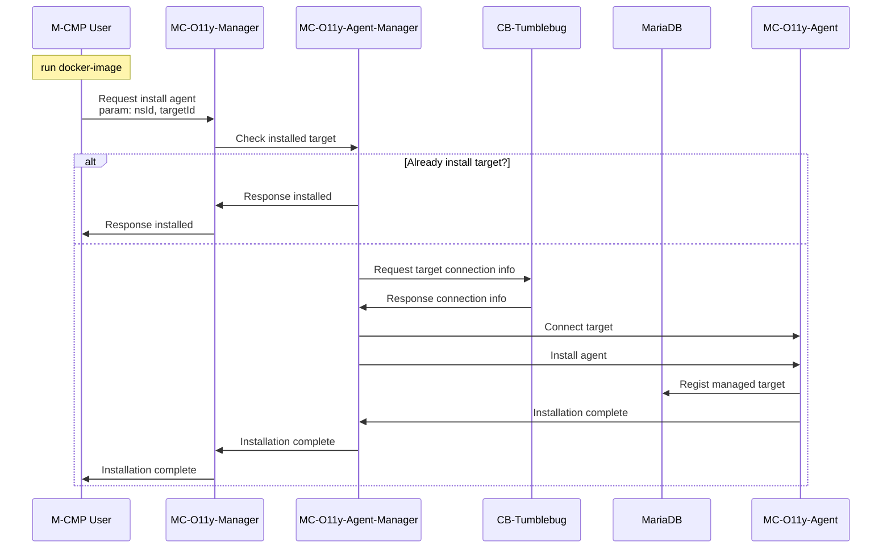

# mc-observability
[](https://app.fossa.com/projects/git%2Bgithub.com%2Fm-cmp%2Fmc-observability?ref=badge_shield)


This repository provides a Monitoring system of M-CMP.

A sub-system of [M-CMP platform](https://github.com/m-cmp/docs/tree/main) to deploy and manage Multi-Cloud Infrastructures. 

## Overview

- The package of this repository is a multi-cloud integrated monitoring framework that provides integrated monitoring capabilities for larger-scale infrastructure services and Kubernetes(K8S) services in a heterogeneous cloud integration environment.
- It offers insights based on operational management information.
- Through integrated monitoring and operational management of multi-clouds, it avoids the complexity between different clouds and centralizes management, enabling stable and efficient system operation.
- The overall flow of the integrated system is as follows: Information, Metrics, events, and log details of the monitoring target are collected through the cloud API and agents installed on vitual servers or physical equipment.\

### System architecture
<details>
<summary>접기/펼치기</summary>




</details>

## How to Use

### Development environment
  - MariaDB (10.7.6)
  - InfluxDB (1.8.10)
  - Chronograf (1.10)
  - Telegraf (1.29.5)
  - SpringBoot (2.7.6)
  - Java (17)
  - cb-tumblebug (edge)
  - cb-spider (edge + Azure Monitoring PoC patched)

### 1. Install Docker to CSP's VM
```shell
sudo apt-get install -y apt-transport-https ca-certificates curl gnupg-agent software-properties-common
curl -fsSL https://download.docker.com/linux/ubuntu/gpg | sudo apt-key add -
sudo add-apt-repository "deb [arch=amd64] https://download.docker.com/linux/ubuntu $(lsb_release -cs) stable"
sudo apt-get update
sudo apt-get install -y docker-ce docker-ce-cli docker-compose-plugin
```

### 2. Clone observability source to CSP's VM
```
git clone https://github.com/m-cmp/mc-observability.git
```

### 3. Go to Java folder
```
cd mc-observability/java-module
```

### 4. set .env (edit .env) (Or skip this step for use defaults.)
```
cp .env.sample .env
```

### 5. Run docker services
```
sudo mkdir -p /docker/opensearch
sudo chown -R 1000:1000 /docker/opensearch
sudo docker compose up -d
```

### 6. Check network listen states
```
sudo ss -nltp | grep docker                                                                                                       12:03:20 PM
LISTEN 0      4096              0.0.0.0:1024       0.0.0.0:*    users:(("docker-proxy",pid=21828,fd=4))
LISTEN 0      4096              0.0.0.0:1324       0.0.0.0:*    users:(("docker-proxy",pid=18004,fd=4))
LISTEN 0      4096              0.0.0.0:1325       0.0.0.0:*    users:(("docker-proxy",pid=17943,fd=4))
LISTEN 0      4096              0.0.0.0:1323       0.0.0.0:*    users:(("docker-proxy",pid=18311,fd=4))
LISTEN 0      4096              0.0.0.0:3306       0.0.0.0:*    users:(("docker-proxy",pid=21737,fd=4))
LISTEN 0      4096              0.0.0.0:5601       0.0.0.0:*    users:(("docker-proxy",pid=22105,fd=4))
LISTEN 0      4096              0.0.0.0:8086       0.0.0.0:*    users:(("docker-proxy",pid=21771,fd=4))
LISTEN 0      4096              0.0.0.0:8082       0.0.0.0:*    users:(("docker-proxy",pid=21805,fd=4))
LISTEN 0      4096              0.0.0.0:8888       0.0.0.0:*    users:(("docker-proxy",pid=21951,fd=4))
LISTEN 0      4096              0.0.0.0:9200       0.0.0.0:*    users:(("docker-proxy",pid=22183,fd=4))
LISTEN 0      4096              0.0.0.0:9600       0.0.0.0:*    users:(("docker-proxy",pid=22160,fd=4))
LISTEN 0      4096              0.0.0.0:18080      0.0.0.0:*    users:(("docker-proxy",pid=21915,fd=4))
LISTEN 0      4096              0.0.0.0:18081      0.0.0.0:*    users:(("docker-proxy",pid=21863,fd=4))
LISTEN 0      4096                 [::]:1024          [::]:*    users:(("docker-proxy",pid=21834,fd=4))
LISTEN 0      4096                 [::]:1324          [::]:*    users:(("docker-proxy",pid=18012,fd=4))
LISTEN 0      4096                 [::]:1325          [::]:*    users:(("docker-proxy",pid=17950,fd=4))
LISTEN 0      4096                 [::]:1323          [::]:*    users:(("docker-proxy",pid=18322,fd=4))
LISTEN 0      4096                 [::]:3306          [::]:*    users:(("docker-proxy",pid=21745,fd=4))
LISTEN 0      4096                 [::]:5601          [::]:*    users:(("docker-proxy",pid=22111,fd=4))
LISTEN 0      4096                 [::]:8086          [::]:*    users:(("docker-proxy",pid=21778,fd=4))
LISTEN 0      4096                 [::]:8082          [::]:*    users:(("docker-proxy",pid=21812,fd=4))
LISTEN 0      4096                 [::]:8888          [::]:*    users:(("docker-proxy",pid=21959,fd=4))
LISTEN 0      4096                 [::]:9200          [::]:*    users:(("docker-proxy",pid=22189,fd=4))
LISTEN 0      4096                 [::]:9600          [::]:*    users:(("docker-proxy",pid=22167,fd=4))
LISTEN 0      4096                 [::]:18080         [::]:*    users:(("docker-proxy",pid=21922,fd=4))
LISTEN 0      4096                 [::]:18081         [::]:*    users:(("docker-proxy",pid=21873,fd=4))
```

### 7. Clone tumblebug source (Run on the same CSP's VM)
```
git clone https://github.com/m-cmp/mc-observability.git
cd cb-tumblebug
```

### 8. Initialize tumblebug (Run on the same CSP's VM)
[Initialize CB-Tumblebug to configure Multi-Cloud info](https://github.com/cloud-barista/cb-tumblebug?tab=readme-ov-file#3-initialize-cb-tumblebug-to-configure-multi-cloud-info)

### 9. Create namespace to tumblebug (Run on the same CSP's VM)
```shell
curl -u default:default -X 'POST' \
  'http://127.0.0.1:1323/tumblebug/ns' \
  -H 'accept: application/json' \
  -H 'Content-Type: application/json' \
  -d '{
  "description": "First namespace",
  "name": "ns01"
}'
```

### 10. Create MCI dynamically (Run on the same CSP's VM)
```shell
curl -u default:default -X 'POST' \
  'http://127.0.0.1:1323/tumblebug/ns/ns01/mciDynamic' \
  -H 'accept: application/json' \
  -H 'Content-Type: application/json' \
  -d '{
  "description": "Made in CB-TB",
  "installMonAgent": "no",
  "label": "DynamicVM",
  "name": "mci01",
  "systemLabel": "",
  "vm": [
    {
      "commonImage": "azure+koreacentral+ubuntu22.04",
      "commonSpec": "azure+koreacentral+standard_b4ls_v2",
      "connectionName": "azure-koreacentral",
      "description": "Description",
      "label": "DynamicVM",
      "name": "g1-1",
      "rootDiskSize": "default",
      "rootDiskType": "default",
      "subGroupSize": "3",
      "vmUserPassword": "string"
    }
  ]
}'
```

### 11. Register monitoring targets to observability manager (Run on any host)
```shell
curl --location 'observability_VM_PUBLIC_IP:18080/api/o11y/monitoring/ns01/mci01/target/g1-1-1' \
--header 'Content-Type: application/json' \
--header 'Accept: */*' \
--data '{
  "description": "vm1",
  "aliasName": "g1"
}'
```
```shell
curl --location 'observability_VM_PUBLIC_IP:18080/api/o11y/monitoring/ns01/mci01/target/g1-1-2' \
--header 'Content-Type: application/json' \
--header 'Accept: */*' \
--data '{
  "description": "vm2",
  "aliasName": "g2"
}'
```
```shell
curl --location 'observability_VM_PUBLIC_IP:18080/api/o11y/monitoring/ns01/mci01/target/g1-1-3' \
--header 'Content-Type: application/json' \
--header 'Accept: */*' \
--data '{
  "description": "vm3",
  "aliasName": "g3"
}'
```

### 12. Check registered monitoring targets from observability (Run on any host)
```shell
curl --location 'observability_VM_PUBLIC_IP:18080/api/o11y/monitoring/ns01/mci01/target' \
--header 'Accept: */*' | jq
```

### 13. Register tail monitoring item to the VM (Run on any host)
g1-1-1 example)

- Encode tail configuration to base64
```shell
echo -e '  files = ["/var/log/syslog"]
  from_beginning = false
  watch_method = "inotify"

  # Data format to parse syslog entries
  data_format = "grok"
  grok_patterns = ["%{SYSLOGTIMESTAMP:timestamp} %{SYSLOGHOST:hostname} %{PROG:program}: %{GREEDYDATA:message}"]

  # Add these fields if you want to tag the logs
  [inputs.tail.tags]
    vm_id = "g1-1-1"
    mci_group_id = "mci01"' | base64 -w 0
```

- Check public IP of g1-1-1 VM
```shell
curl -u default:default -X 'GET' \
  'http://observability_VM_PUBLIC_IP:1323/tumblebug/ns/ns01/mci/mci01/vm/g1-1-1' \
  -H 'accept: application/json' | jq | grep publicIP
```

- Send request with encoded pluginConfig content to g1-1-1 VM
```shell
curl --location 'g1-1-1_VM_PUBLIC_IP:18081/api/o11y/monitoring/ns01/mci01/target/g1-1-1/item' \
--header 'Content-Type: application/json' \
--header 'Accept: */*' \
--data '{
  "name": "tail",
  "pluginSeq": "7",
  "pluginConfig": "ICBmaWxlcyA9IFsiL3Zhci9sb2cvc3lzbG9nIl0KICBmcm9tX2JlZ2lubmluZyA9IGZhbHNlCiAgd2F0Y2hfbWV0aG9kID0gImlub3RpZnkiCgogICMgRGF0YSBmb3JtYXQgdG8gcGFyc2Ugc3lzbG9nIGVudHJpZXMKICBkYXRhX2Zvcm1hdCA9ICJncm9rIgogIGdyb2tfcGF0dGVybnMgPSBbIiV7U1lTTE9HVElNRVNUQU1QOnRpbWVzdGFtcH0gJXtTWVNMT0dIT1NUOmhvc3RuYW1lfSAle1BST0c6cHJvZ3JhbX06ICV7R1JFRURZREFUQTptZXNzYWdlfSJdCgogICMgQWRkIHRoZXNlIGZpZWxkcyBpZiB5b3Ugd2FudCB0byB0YWcgdGhlIGxvZ3MKICBbaW5wdXRzLnRhaWwudGFnc10KICAgIHZtX2lkID0gImcxLTEtMSIKICAgIG1jaV9ncm91cF9pZCA9ICJtY2kwMSIK"
}'
```

### 14. Register opensearch monitoring item to the VM (Run on any host)
g1-1-1 example)

- Send request with encoded pluginConfig content
```shell
echo -e '  urls = ["http://observability_VM_PUBLIC_IP:9200"]
  index_name = "telegraf-test"
  template_name = "telegraf-*"' | base64 -w 0
```

- Send request with encoded pluginConfig content
```shell
curl --location 'g1-1-1_VM_PUBLIC_IP:18081/api/o11y/monitoring/ns01/mci01/target/g1-1-1/item' \
--header 'Content-Type: application/json' \
--header 'Accept: */*' \
--data '{
  "name": "opensearch",
  "pluginSeq": "10",
  "pluginConfig": "XXXXXXXXXXXXXXXXXXXXXXXXXXXXXXXXXXXXXXXXXXXX"
}'
```

### 15. Check registered OpenSearch servers
```shell
curl --location 'observability_VM_PUBLIC_IP:18080/api/o11y/monitoring/opensearch' \
--header 'Accept: */*' | jq
```

### 16. Check VM's syslog (Run on any host)
g1-1-1 example)

```shell
curl --location 'observability_VM_PUBLIC_IP:18080/api/o11y/monitoring/opensearch/1/logs' \
--header 'Content-Type: application/json' \
--header 'Accept: */*' \
--data '{
  "range": "1d/d",
  "limit": "3"
}' | jq
```

- Response example
    <details>
    <summary>접기/펼치기</summary>
    
    ```json
    {
        "data": [
            {
                "@timestamp": "2024-09-19T10:56:56.641954674Z",
                "measurement_name": "tail",
                "tag": {
                    "host": "44f7ab229e2b",
                    "mci_group_id": "mci01",
                    "mci_id": "mci01",
                    "ns_id": "ns01",
                    "path": "/var/log/syslog",
                    "target_id": "g1-1-1",
                    "vm_id": "g1-1-1"
                },
                "tail": {
                    "hostname": "crlrvke4322s738t4bvg",
                    "message": "[17296.138673] docker0: port 1(veth64c8848) entered disabled state",
                    "program": "kernel",
                    "timestamp": "Sep 19 10:56:56"
                }
            },
            {
                "@timestamp": "2024-09-19T10:56:56.80143192Z",
                "measurement_name": "tail",
                "tag": {
                    "host": "44f7ab229e2b",
                    "mci_group_id": "mci01",
                    "mci_id": "mci01",
                    "ns_id": "ns01",
                    "path": "/var/log/syslog",
                    "target_id": "g1-1-1",
                    "vm_id": "g1-1-1"
                },
                "tail": {
                    "hostname": "crlrvke4322s738t4bvg",
                    "message": "[17296.295880] eth0: renamed from veth74b7f62",
                    "program": "kernel",
                    "timestamp": "Sep 19 10:56:56"
                }
            },
            {
                "@timestamp": "2024-09-19T10:56:56.825379239Z",
                "measurement_name": "tail",
                "tag": {
                    "host": "44f7ab229e2b",
                    "mci_group_id": "mci01",
                    "mci_id": "mci01",
                    "ns_id": "ns01",
                    "path": "/var/log/syslog",
                    "target_id": "g1-1-1",
                    "vm_id": "g1-1-1"
                },
                "tail": {
                    "hostname": "crlrvke4322s738t4bvg",
                    "message": "[17296.319992] docker0: port 1(veth64c8848) entered blocking state",
                    "program": "kernel",
                    "timestamp": "Sep 19 10:56:56"
                }
            }
        ],
        "errorMessage": null,
        "rsCode": "0000",
        "rsMsg": "완료되었습니다."
    }
    ```
    </details>

### 17. Check VM's monitoring data
- Supported metric types
  - cpu_usage (%)
  - memory_usage (Bytes)
  - disk_read (Bytes)
  - disk_write (Bytes)
  - disk_read_ops (Bytes)
  - disk_write_ops (Bytes)
  - network_in (Bytes)
  - network_out (Bytes)
- Range and interval of metrics
  - Retrieves 1-minute interval metric data from 1 hour ago
- Time is displayed in UTC.

g1-1-1 cpu_usage example)

```shell
curl --location 'observability_VM_PUBLIC_IP:18080/api/o11y/monitoring/ns01/mci01/target/g1-1-1/csp/cpu_usage' \
--header 'Accept: */*' | jq
```

- Response example
    <details>
    <summary>접기/펼치기</summary>

    ```json
    {
      "data": {
        "metricName": "Percentage CPU",
        "metricUnit": "Percent",
        "timestampValues": [
          {
            "timestamp": "2024-09-20T01:54:00Z",
            "value": "0.345"
          },
          {
            "timestamp": "2024-09-20T01:55:00Z",
            "value": "0.355"
          },
          {
            "timestamp": "2024-09-20T01:56:00Z",
            "value": "0.355"
          },
          {
            "timestamp": "2024-09-20T01:57:00Z",
            "value": "0.365"
          },
          {
            "timestamp": "2024-09-20T01:58:00Z",
            "value": "0.365"
          },
          {
            "timestamp": "2024-09-20T01:59:00Z",
            "value": "0.375"
          },
          {
            "timestamp": "2024-09-20T02:00:00Z",
            "value": "0.36"
          },
          {
            "timestamp": "2024-09-20T02:01:00Z",
            "value": "0.445"
          },
          {
            "timestamp": "2024-09-20T02:02:00Z",
            "value": "0.4"
          },
          {
            "timestamp": "2024-09-20T02:03:00Z",
            "value": "0.345"
          },
          {
            "timestamp": "2024-09-20T02:04:00Z",
            "value": "0.345"
          },
          {
            "timestamp": "2024-09-20T02:05:00Z",
            "value": "0.33"
          },
          {
            "timestamp": "2024-09-20T02:06:00Z",
            "value": "0.35"
          },
          {
            "timestamp": "2024-09-20T02:07:00Z",
            "value": "0.375"
          },
          {
            "timestamp": "2024-09-20T02:08:00Z",
            "value": "0.39"
          },
          {
            "timestamp": "2024-09-20T02:09:00Z",
            "value": "0.345"
          },
          {
            "timestamp": "2024-09-20T02:10:00Z",
            "value": "0.405"
          },
          {
            "timestamp": "2024-09-20T02:11:00Z",
            "value": "0.345"
          },
          {
            "timestamp": "2024-09-20T02:12:00Z",
            "value": "0.335"
          },
          {
            "timestamp": "2024-09-20T02:13:00Z",
            "value": "0.33"
          },
          {
            "timestamp": "2024-09-20T02:14:00Z",
            "value": "0.33"
          },
          {
            "timestamp": "2024-09-20T02:15:00Z",
            "value": "0.31"
          },
          {
            "timestamp": "2024-09-20T02:16:00Z",
            "value": "0.31"
          },
          {
            "timestamp": "2024-09-20T02:17:00Z",
            "value": "0.31"
          },
          {
            "timestamp": "2024-09-20T02:18:00Z",
            "value": "0.28"
          },
          {
            "timestamp": "2024-09-20T02:19:00Z",
            "value": "0.28"
          },
          {
            "timestamp": "2024-09-20T02:20:00Z",
            "value": "0.29"
          },
          {
            "timestamp": "2024-09-20T02:21:00Z",
            "value": "0.285"
          },
          {
            "timestamp": "2024-09-20T02:22:00Z",
            "value": "0.275"
          },
          {
            "timestamp": "2024-09-20T02:23:00Z",
            "value": "0.305"
          },
          {
            "timestamp": "2024-09-20T02:24:00Z",
            "value": "0.27"
          },
          {
            "timestamp": "2024-09-20T02:25:00Z",
            "value": "0.275"
          },
          {
            "timestamp": "2024-09-20T02:26:00Z",
            "value": "0.27"
          },
          {
            "timestamp": "2024-09-20T02:27:00Z",
            "value": "0.265"
          },
          {
            "timestamp": "2024-09-20T02:28:00Z",
            "value": "0.27"
          },
          {
            "timestamp": "2024-09-20T02:29:00Z",
            "value": "0.275"
          },
          {
            "timestamp": "2024-09-20T02:30:00Z",
            "value": "0.305"
          },
          {
            "timestamp": "2024-09-20T02:31:00Z",
            "value": "0.315"
          },
          {
            "timestamp": "2024-09-20T02:32:00Z",
            "value": "0.265"
          },
          {
            "timestamp": "2024-09-20T02:33:00Z",
            "value": "0.28"
          },
          {
            "timestamp": "2024-09-20T02:34:00Z",
            "value": "0.265"
          },
          {
            "timestamp": "2024-09-20T02:35:00Z",
            "value": "0.26"
          },
          {
            "timestamp": "2024-09-20T02:36:00Z",
            "value": "0.26"
          },
          {
            "timestamp": "2024-09-20T02:37:00Z",
            "value": "0.51"
          },
          {
            "timestamp": "2024-09-20T02:38:00Z",
            "value": "13.18"
          },
          {
            "timestamp": "2024-09-20T02:39:00Z",
            "value": "13.165"
          },
          {
            "timestamp": "2024-09-20T02:40:00Z",
            "value": "0.98"
          },
          {
            "timestamp": "2024-09-20T02:41:00Z",
            "value": "0.685"
          },
          {
            "timestamp": "2024-09-20T02:42:00Z",
            "value": "0.455"
          },
          {
            "timestamp": "2024-09-20T02:43:00Z",
            "value": "0.445"
          },
          {
            "timestamp": "2024-09-20T02:44:00Z",
            "value": "0.37"
          },
          {
            "timestamp": "2024-09-20T02:45:00Z",
            "value": "0.475"
          },
          {
            "timestamp": "2024-09-20T02:46:00Z",
            "value": "0.44"
          },
          {
            "timestamp": "2024-09-20T02:47:00Z",
            "value": "0.34"
          },
          {
            "timestamp": "2024-09-20T02:48:00Z",
            "value": "0.31"
          },
          {
            "timestamp": "2024-09-20T02:49:00Z",
            "value": "0.32"
          },
          {
            "timestamp": "2024-09-20T02:50:00Z",
            "value": "0.375"
          },
          {
            "timestamp": "2024-09-20T02:51:00Z",
            "value": "0.34"
          },
          {
            "timestamp": "2024-09-20T02:52:00Z",
            "value": "0.245"
          },
          {
            "timestamp": "2024-09-20T02:53:00Z",
            "value": "0.365"
          }
        ]
      },
      "errorMessage": null,
      "rsCode": "0000",
      "rsMsg": "완료되었습니다."
    }
    ```
    </details>

### Swagger Docs
#### [v0.3.0 swagger api](https://m-cmp.github.io/mc-observability/java-module/swagger/index.html)

### API Use guide (swagger docs linked mermaid contents)
#### Observability Monitoring target setting guide



## How to Contribute

- Issues/Discussions/Ideas: Utilize issue of mc-observability


## License
[](https://app.fossa.com/projects/git%2Bgithub.com%2Fm-cmp%2Fmc-observability?ref=badge_large)