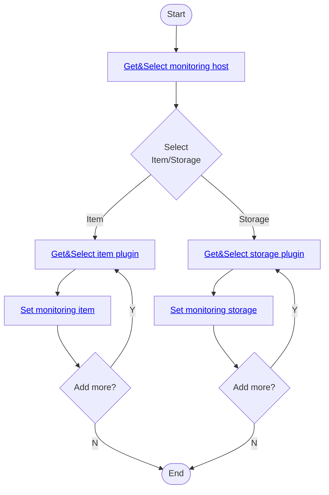
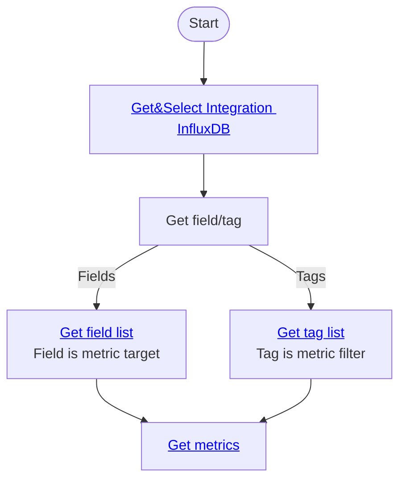
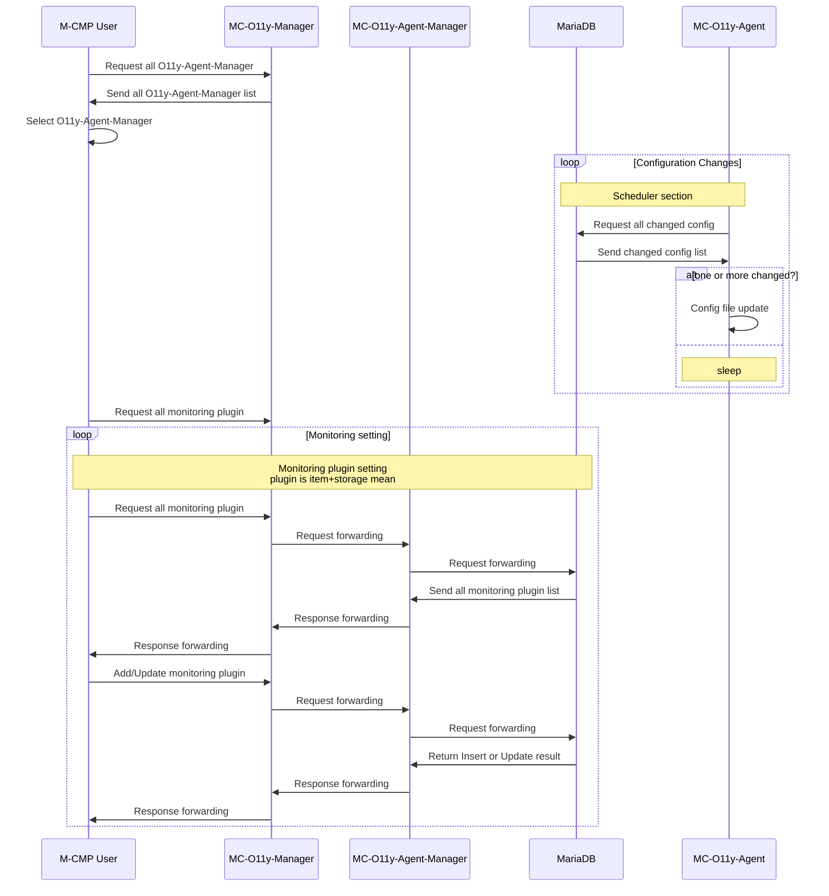

# mc-observability

This repository provides a Monitoring system of M-CMP.

A sub-system of [M-CMP platform](https://github.com/m-cmp/docs/tree/main) to deploy and manage Multi-Cloud Infrastructures. 

## Overview

- The package of this repository is a multi-cloud integrated monitoring framework that provides integrated monitoring capabilities for larger-scale infrastructure services and Kubernetes(K8S) services in a heterogeneous cloud integration environment.
- It offers insights based on operational management information.
- Through integrated monitoring and operational management of multi-clouds, it avoids the complexity between different clouds and centralizes management, enabling stable and efficient system operation.
- The overall flow of the integrated system is as follows: Information, Metrics, events, and log details of the monitoring target are collected through the cloud API and agents installed on vitual servers or physical equipment.

## How to Use

### Development environment
  - SpringBoot (2.7.6)
  - MariaDB (10.7.6)
  - InfluxDB (1.8.10)
  - Telegraf (1.26.1)
  - Java (17)

### Use guide
#### Observability Monitoring target setting guide

#### Observability Metrics view guide

#### M-CMP Observability monitoring setting sequenceDiagram

### Use guide & basic scenario Full [ppt](./M-CMP%20Agent%20Use%20guide.ppt) / [pdf](./M-CMP%20Agent%20Use%20guide%2020240531.pdf)

### [API Docs yaml](./swagger.yaml)

## How to Contribute

- Issues/Discussions/Ideas: Utilize issue of mc-observability

## License
